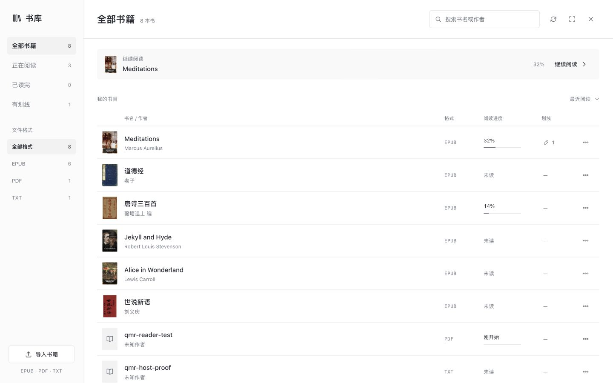
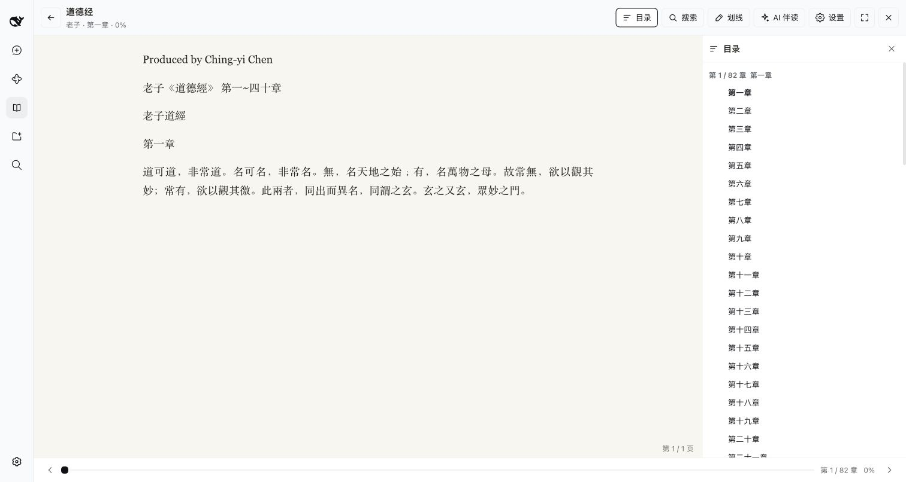
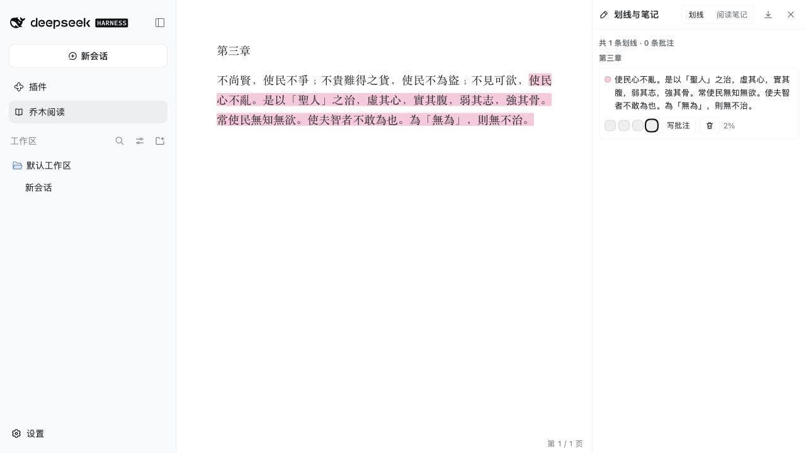

# 乔木阅读 · 把书读进你的工作流

**中文** · [English](#english) · [下载安装](https://github.com/joeseesun/qiaomu-reader-dsh/releases/latest) · [反馈问题](https://github.com/joeseesun/qiaomu-reader-dsh/issues)

在 DeepSeek Harness 里打开一本书，读到值得记住的地方就划线、写批注，再把问题交给旁边的 AI。阅读进度和 Markdown 笔记留在本地，下一次继续读。



> 新版书库实际组件预览，使用内置公版书与测试文件；Harness 桌面安装版也已确认界面、搜索与更多菜单。[验证说明](docs/RELEASE-VALIDATION.md)

## 为什么装它

| 你想做的事 | 乔木阅读怎么帮你 |
| --- | --- |
| 把散落的电子书放在一起 | 导入 EPUB、PDF、TXT，在书库搜索、排序，查看阅读状态 |
| 回到上次读到的地方 | 保存进度，通过目录、正文搜索和进度条定位 |
| 留下自己的理解 | 划线与批注，整理为 Markdown 阅读笔记 |
| 读到不明白的段落 | 打开 AI 伴读，让书籍与选文上下文跟随问题进入 Harness 对话 |
| 先试试看，不想找文件 | 内置六本经典示例书，安装后就能打开阅读 |



EPUB 适合按章节阅读，TXT 支持文本分章，PDF 使用 PDF.js 展示页面与可提取文本。复杂排版、扫描型 PDF 和 DRM 加密电子书不属于本轮验证范围；不提供 DRM 解密或 OCR。

## v1.0.2 更新

- C「清晰书目」书库：分类导航、小封面、对齐的进度与更多菜单。
- 新增真正的纯白主题（`#ffffff`），与暖色「纸白」分别选择。
- 划线只保留柔和底色，聚焦与跨行时没有围框，夜间文字继承阅读主题。
- 阅读工具栏自动隐藏、目录置于底部、可拖动 AI 分屏与更紧凑的伴读标题。



## 安装后，先读一章

需要 **DeepSeek Harness 0.2.0-rc.2** 和 `dsh` CLI。使用预构建安装包无需自行构建源码；目前未发布 npm。

1. 从 [v1.0.2 Release](https://github.com/joeseesun/qiaomu-reader-dsh/releases/tag/v1.0.2) 下载 `.tgz` 与 `.sha256`。
2. 在下载目录执行：

```bash
shasum -a 256 -c qiaomu-reader-dsh-1.0.2.tgz.sha256
dsh plugin --profile desktop add "$PWD/qiaomu-reader-dsh-1.0.2.tgz"
```

3. 重启对应的 Harness profile，点击侧栏「乔木阅读」，打开《道德经》或通过「导入书籍」选择自己的文件。

将 `desktop` 替换为实际的 Web 或自定义 profile 名称。普通阅读不需要模型密钥；AI 伴读需要在 Harness 配置可用模型与账号。插件不会替你提供模型额度。[官方安装文档](https://github.com/deepseek-ai/deepseek-harness/blob/master/docs/user/develop/basic/publish.md)

升级时安装新包并重启同一 profile。暂时停用可在 Harness 插件管理中禁用 Reader；卸载或迁移前备份下面的完整书库目录。

## 本地书库与隐私

宿主书库目录名默认为 `乔木阅读`，包含 `books/`、`state/`、`notes/` 和 `library.json`。根目录优先采用插件配置 `workspaceRoot`，其次是 `DSH_WORKSPACE` 环境变量，最后是宿主进程的启动目录。书库根目录不随当前聊天工作区切换；需要稳定位置时显式配置 `workspaceRoot`。

电子书、进度和笔记由本地宿主管理，不会因为安装插件自动上传到云端。**主动使用 AI 伴读时，相关书籍/选文上下文会交给 Harness 的模型服务**，按该服务的配置和规则处理。插件没有独立账号或云同步。网页浏览器端与宿主文件保存的行为取决于部署方式，远程宿主的“本地”指宿主机器。

内置示例书文本来自 Project Gutenberg，保留书内来源与许可章节；见 [第三方来源说明](THIRD_PARTY_NOTICES.md)。这些内容的许可独立于插件源码。

## 开发与质量检查

```bash
git clone https://github.com/joeseesun/qiaomu-reader-dsh.git
cd qiaomu-reader-dsh
npm ci
npm run check
npm pack
```

Node.js 22+。`src/core/` 是书籍解析与阅读状态，`src/client/` 是界面和宿主桥接，`src/host/` 是文件书库与工具。`client.js`、`index.js` 是构建产物，随源码一起提交。打包前会自动构建并检查所有导出入口与 bundle 文件。

构建直接使用已提交的 `media/starter-books.js`。只有重新制作示例书时，才需要原始 EPUB 目录：`npm run books -- --source /absolute/path/to/starter-books`，也可设置 `QIAOMU_STARTER_BOOKS`；目录需含 `catalog.json` 和相应 EPUB。

本轮通过 **47 项自动化测试**，覆盖 EPUB/TXT/PDF 样例、状态与笔记等；独立 Harness Web profile 已验证 tgz 安装、宿主启动、书库、打开 EPUB 和目录。AI 推理、全部格式的真实文件导入及其他操作系统未在本轮端到端覆盖。[详细验证](docs/RELEASE-VALIDATION.md)

## 参与与许可

这是独立社区插件，不是 DeepSeek 官方产品。欢迎在 [Issues](https://github.com/joeseesun/qiaomu-reader-dsh/issues) 提交格式兼容问题，请提供可公开的最小样例，避免上传个人书库。参与开发请看 [贡献指南](CONTRIBUTING.md)。源码采用 [GPL-3.0-only](LICENSE)，PDF.js 和示例书保留各自许可；安全问题见 [SECURITY.md](SECURITY.md)。

---

<a id="english"></a>
## English

**Read a book without leaving your Harness workflow.** Qiaomu Reader brings EPUB, PDF and TXT into a local library, with reading progress, chapter navigation, search, highlights, annotations, Markdown notes and an AI companion backed by the host conversation. Six classic starter books let you try it immediately.

The library screenshot shows the actual component using starter books and test fixtures; the desktop host library has also been checked. The reading screenshot comes from an isolated Harness Web profile. **Install:** download the tarball and checksum from [v1.0.2](https://github.com/joeseesun/qiaomu-reader-dsh/releases/tag/v1.0.2), run the checksum and installation commands above, then restart your profile and open **Qiaomu Reader**. Replace `desktop` with your profile name. No source build is required; there is no npm release.

Reading does not require a model key. AI companion actions require a configured Harness model and send the relevant reading context to that provider. Library files remain on the host under `乔木阅读`: the root is configured `workspaceRoot`, then `DSH_WORKSPACE`, then the host process working directory. Back up the entire folder before migrating. No independent cloud sync is provided.

Verified on macOS with Harness 0.2.0-rc.2: 47 automated tests, isolated tarball installation, host boot, library display, EPUB reading and chapter navigation. This pass did not exercise live model inference or all real-world PDF/TXT imports. Scanned PDFs, DRM and complex layouts are not promised. See [release validation](docs/RELEASE-VALIDATION.md), [third-party notices](THIRD_PARTY_NOTICES.md) and the [GPL-3.0-only license](LICENSE).
